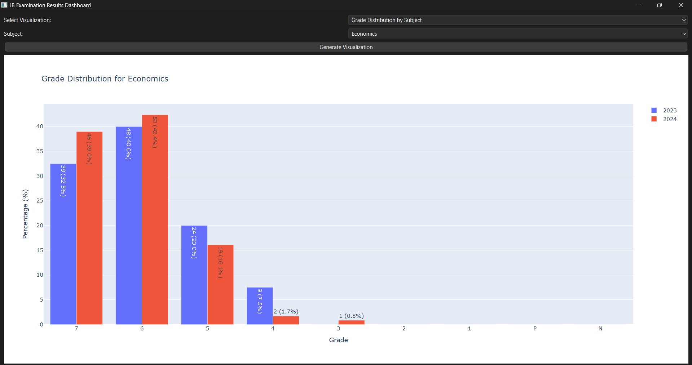
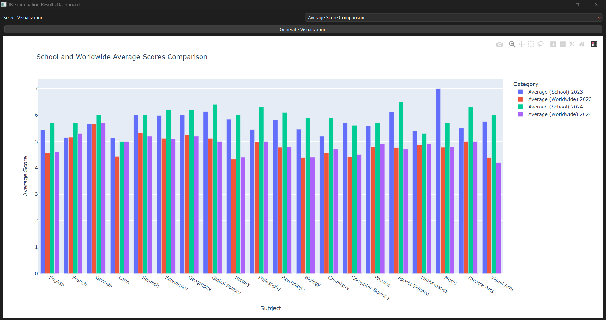
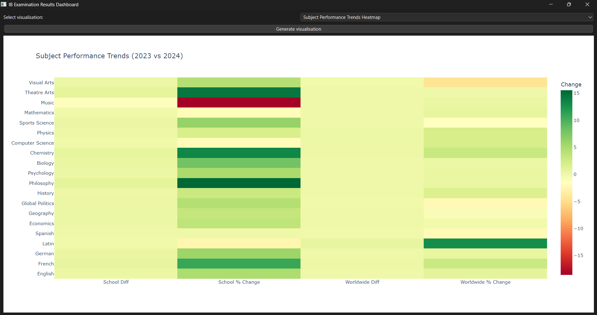
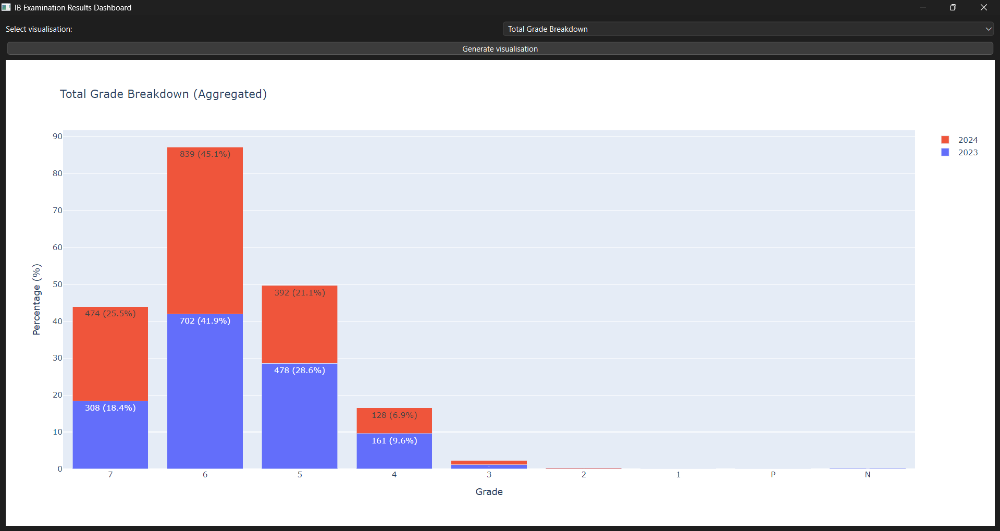
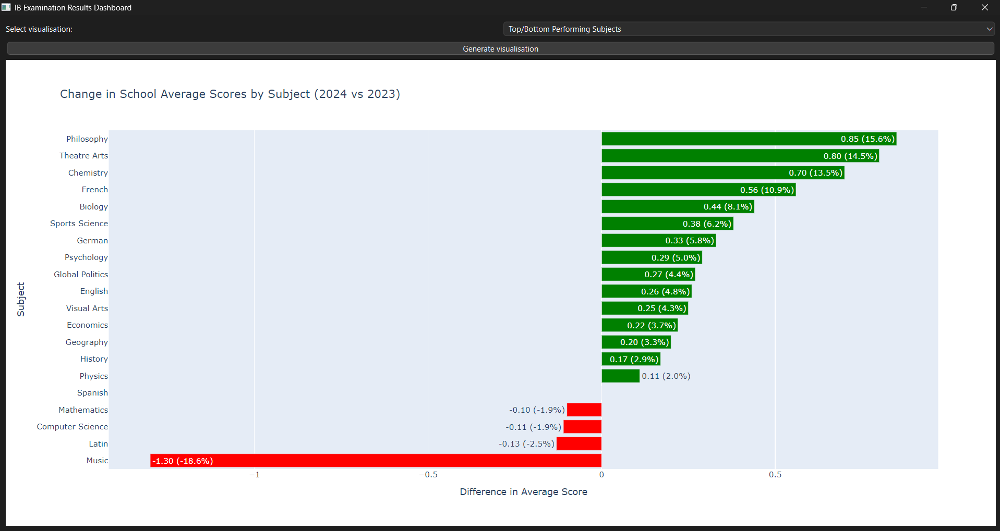
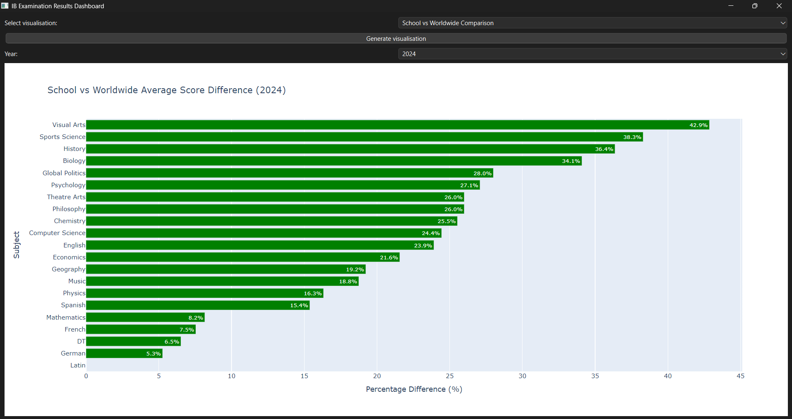
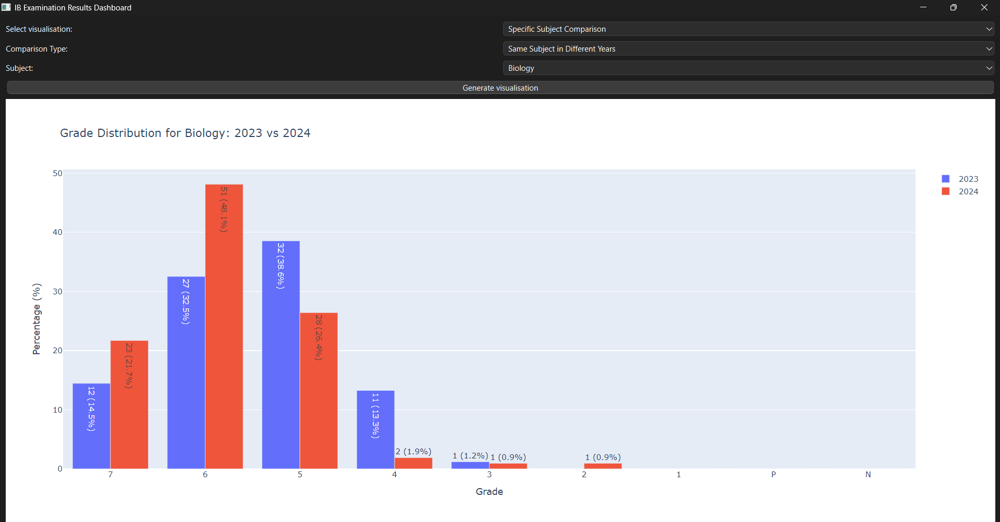

# IB Examination Results Dashboard

Dashboard application for visualising and comparing International Baccalaureate (IB) examination results in Dartford Grammar School across subjects and years 2023 to 2024. Built using PyQt6-WebEngine framework.

## Features

- **Grade Distribution by Subject**: Compare grade distributions for a specific subject between 2023 and 2024.
- **Average Score Comparison**: View school vs. worldwide average scores for subjects with complete data.
- **Subject Performance Trends Heatmap**: Analyze changes in school and worldwide averages via a heatmap.
- **Total Grade Breakdown**: See aggregated grade distributions for all subjects.
- **Top/Bottom Performing Subjects**: Rank subjects by improvement/decline in school averages.
- **School vs Worldwide Comparison**: Compare school performance against global averages for a selected year.
- **Specific Subject Comparisons**: Compare two subjects in the same year or track a subject across years.

## Prerequisites

- Python 3.9+
- Libraries: `PyQt6`, `pandas`, `numpy`, `plotly`, `seaborn`, `matplotlib`, `PyQt6-WebEngine`

## Installation

1. Clone the repository.
2. Install dependencies:
   ```cmd
   pip install PyQt6 pandas numpy plotly seaborn matplotlib PyQt6-WebEngine
   ```
3. Place your CSV files (`data2023.csv` and `data2024.csv`) in the project directory.

## Usage

Run the script:
```cmd
python "main.py"
```

- Select a visualisation type from the dropdown.
- Adjust input parameters (e.g., subjects, years) as needed.
- Click **Generate Visualisation** to render the plot.

## Screenshots

1. **Grade Distribution**  
     
   *Grouped bar chart showing grade percentages for a subject across two years.*

2. **Average Comparison**  
     
   *Grouped bar chart comparing school and worldwide averages by subject.*

3. **Performance Trends Heatmap**  
     
   *Heatmap showing score changes (absolute and percentage) between 2023 and 2024.*

4. **Total Grade Breakdown**
   
   *Bar chart showing the aggregated grades for the school across all subjects in 2023 and 2024.*

5. **Top/Bottom Performers**  
     
   *Ranked subjects by improvement (green) or decline (red) in school averages.*

6. **School vs Worldwide Difference**  
     
   *Ranked horizontal bar chart showing percentage differences between school and global averages.*

7. **Subject Specific Comparisons**
   
   *Two bar charts or a grouped bar chard showing the grades of two subjects in the same year, or       the same subject in two years.*

## License

MIT License. See `LICENSE` for details.
